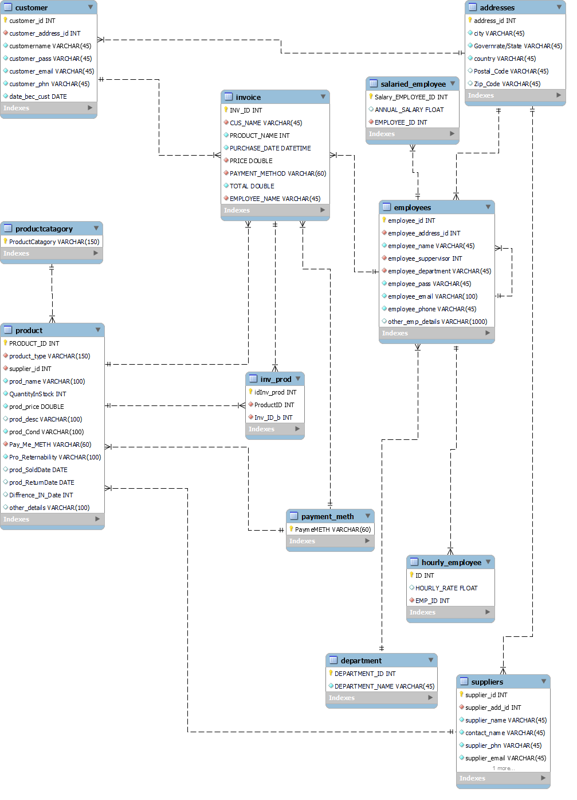

# GUI-Based Shopping System with Database Integration Using PyQt5
A user-friendly and efficient shopping system built with PyQt5 for the GUI and integrated with a relational database (PostgreSQL or MySQL). This application allows admins to manage products, customers, and suppliers, while customers can browse products, manage their cart, and view invoices.

---

## Features

- **User Roles**:
  - **Admin**: Manage customers, products, and suppliers.
  - **Customer**: Browse products, manage cart, and view invoices.
  
- **Database Support**:
  - Compatible with PostgreSQL or MySQL for robust data storage.
  
- **Ease of Use**:
  - Interactive and role-specific panels for admins and customers.
  
- **Scalable**:
  - Modular code structure to easily add new features.

---

## Project Structure

```
.
├── main.py                # Main program to run the application
├── login.py               # User login and registration logic
├── admin_panel.py         # Admin panel navigation
├── admin_customer.py      # Admin functionalities to manage customers
├── admin_product.py       # Admin functionalities to manage products
├── admin_supplier.py      # Admin functionalities to manage suppliers
├── customer.py            # Customer functionalities (products, cart, invoices)
├── ui_forms/              # UI files for all windows
├── sample_database.sql    # SQL file to set up the database
├── erd_diagram.png        # Database Entity Relationship Diagram
```

---

## Prerequisites

- Python 3.8 or higher
- PostgreSQL or MySQL
- Required libraries:
  ```bash
  pip install PyQt5 mysql-connector-python psycopg2
  ```

---

## Setting Up the Database

### Step 1: Install Database
- Install [PostgreSQL](https://www.postgresql.org/download/) or [MySQL](https://www.mysql.com/downloads/).

### Step 2: Create the Database
1. Create a new database:
   ```sql
   CREATE DATABASE inventory_management;
   ```

2. Import the provided SQL schema:
   ```bash
   psql -U <username> -d inventory_management -f sample_database.sql
   ```

---

## Configuration

Update the database credentials in the `config.py` file:

```python
DatabaseConfig = {
    'user': 'your_username',#root
    'password': 'your_password',#admin
    'host': 'localhost',
    'database': 'sample_database'
}
```

---

## Running the Application

1. Ensure all prerequisites are installed and the database is set up.
2. Run the application:
   ```bash
   python main.py
   ```
3. Log in or register as:
   - **Admin**: Access administrative features like product, customer, and supplier management.
   - **Customer**: Browse products, manage the cart, and view invoices.

---

## Application Overview

### 1. Login and Registration
- Log in or register as a customer or admin.
- Redirected to role-specific panels.

### 2. Admin Panel
- **Customer Management**: Add, edit, delete, and search customer data.
- **Product Management**: Manage inventory and pricing.
- **Supplier Management**: Maintain supplier details.

### 3. Customer Panel
- **Browse Products**: View available products.
- **Cart Management**: Add/remove products and calculate totals.
- **Invoice History**: View past purchases and invoices.

---

## Database Diagram

Refer to the Entity Relationship Diagram (ERD) for an overview of the database structure:



---

## Customization

- **Adding New Features**:
  - Create a new UI file in the `ui_forms/` directory.
  - Add the corresponding logic in a new Python module.
  - Register the new feature in `main.py`.

- **Modifying Database**:
  - Update `sample_database.sql` for schema changes.
  - Adjust queries in the respective Python modules.

---

## Future Improvements

- Add analytics dashboards for sales and customer trends.
- Integrate third-party APIs for payments and supplier management.
- Introduce additional user roles like delivery personnel.

---


For questions or issues, contact [egad@uwo.ca](mailto:egad@uwo.ca).
